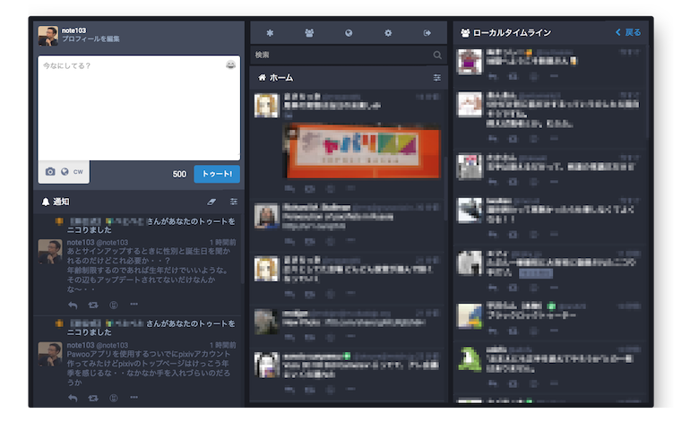
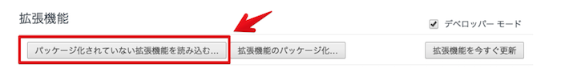

# Mastodon MOD

MastodonのUIを変更して4カラムを画面いっぱいに4分割してリフローさせる簡単なCSSの変更をするChromium Extension。

Firefoxへの対応は面倒なのでやっていない。

friends.nicoにしか対応させていないので、ほかのマストドンのインスタンスに使う場合はmanifest.jsonのpermissionとcontent_scriptのURLを追加すること。

## Image

## Installation

1\. Chrome拡張機能の[設定画面](chrome://extensions/)からデータの読み込みボタンをクリック。

2\. データをフォルダごと選択。

3\. 以後、ソースファイルを更新するたびに拡張機能設定画面＆対象ページをリロードすることで更新が反映される。
